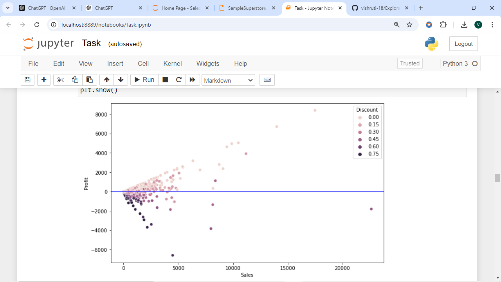
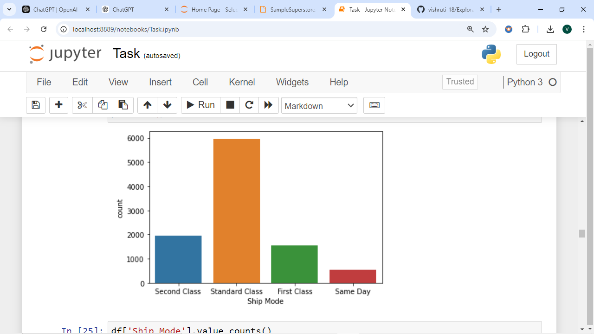
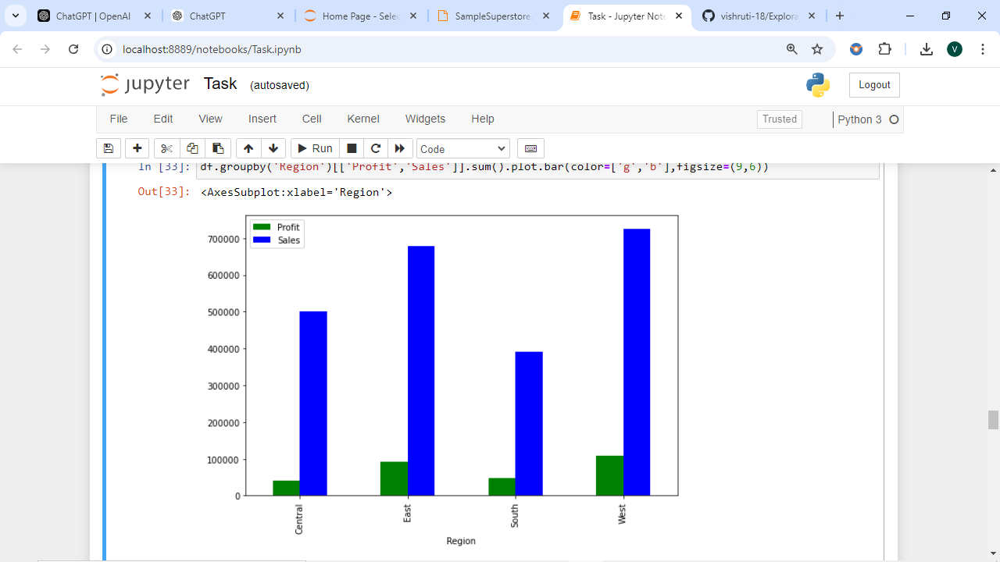
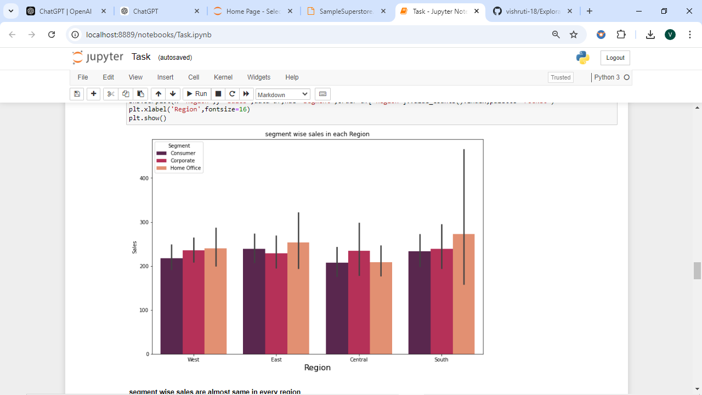
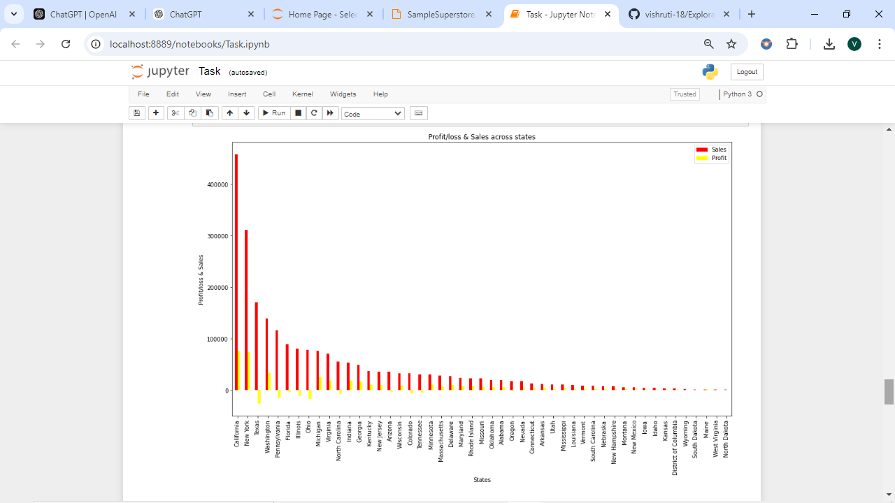
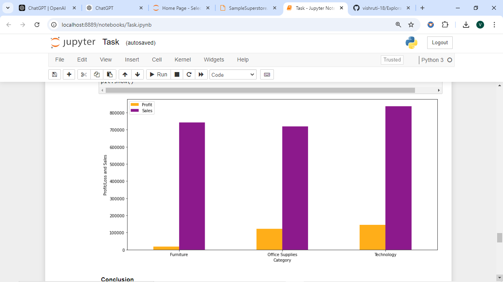
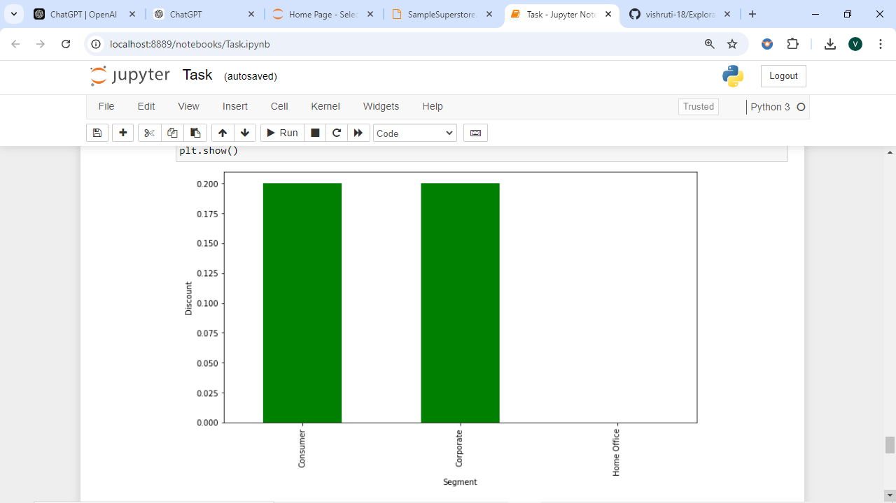

# Exploratory Data Analysis - Retail

## Author: VISHRUTI MATHUR

---

## Problem Statement:

Perform Exploratory Data Analysis (EDA) on the dataset **"Sample Superstore"**. As a business manager, the goal is to identify weak areas where actions can be taken to increase profitability.

---

## Dataset Overview:

The dataset provided consists of the following columns:
- **Ship Mode**: The shipping method used.
- **Segment**: The type of customer segment (Consumer, Corporate, Home Office).
- **Country**: The country where the transaction occurred (in this case, United States).
- **City**: The city where the transaction occurred.
- **State**: The state where the transaction occurred.
- **Postal Code**: The postal code of the city.
- **Region**: The region where the transaction occurred (West, East, Central, South).
- **Category**: The category of the product (Furniture, Technology, Office Supplies).
- **Sub-Category**: The sub-category of the product (e.g., Chairs, Phones, etc.).
- **Sales**: The sales amount for the product.
- **Quantity**: The number of units sold.
- **Discount**: The discount applied to the transaction.
- **Profit**: The profit made from the transaction.

---

## Key Findings & Visualizations:

### 1. **Impact of Discounts on Sales and Profit**
   - **Finding**: Discounts and profit are negatively correlated (-0.22), meaning higher discounts tend to decrease profit. However, discounts and sales are positively correlated (0.48), indicating that higher discounts drive more sales.
   
   
   

### 2. **Correlation Between Sales and Profit**
   - **Finding**: There is a weak positive correlation between sales and profit, suggesting that higher sales generally lead to increased profit, but the relationship is not very strong.
   
   

### 3. **Shipment Mode Insights**
   - **Finding**: The **Standard Class** mode has the highest number of shipments, while **Same Day** mode has the lowest number of shipments.
   
   

### 4. **Regional Sales and Profit Insights**
   - **Finding**: Sales and profits are highest in the **West** region, while both sales and profit are lowest in the **South** region.
   
   
   

### 5. **State-wise Profit Analysis**
   - **Finding**: States like **California** and **New York** generate the highest profits, while **Texas**, **Pennsylvania**, and **Ohio** show significant losses.
   
   

### 6. **Category-wise Profit**
   - **Finding**: The **Technology** and **Office Supplies** categories have higher profits, whereas **Furniture** shows relatively less profit.
   
   

### 7. **Customer Segment Insights**
   - **Finding**: Customers in the **Home Office** segment tend to make more purchases with no discounts compared to the other customer segments.
   
   

### 8. **Sub-category Performance**
   - **Finding**: The **Phones** sub-category has the highest sales. Although **Chairs** also have high sales, their profits are lower compared to phones. Sub-categories like **Tables** and **Bookcases** are experiencing significant losses.
   
   
   

---

## Conclusion:

1. **Discount and Profit Relationship**: There is a negative correlation between discount and profit, indicating that offering more discounts leads to lower profits, though it may increase sales.
2. **Shipment Mode**: The **Standard Class** mode dominates in terms of shipments, and **Same Day** mode is the least used.
3. **Regional Insights**: The **West** region generates the highest profit, while the **South** region shows the weakest performance.
4. **State-wise Profit**: **California** and **New York** are the most profitable states, whereas **Texas**, **Pennsylvania**, and **Ohio** are areas of concern with high losses.
5. **Category Insights**: **Technology** and **Office Supplies** are the most profitable categories, while **Furniture** shows lower profitability.
6. **Customer Segment**: **Home Office** customers tend to make purchases with fewer discounts.
7. **Sub-category Weaknesses**: **Tables** and **Bookcases** sub-categories face significant losses, indicating a need for review and action.

---

## Setup and Installation:

1. Install the required Python libraries by running:
   ```bash
   pip install pandas matplotlib seaborn
   ```

2. Clone this repository:
   ```bash
   git clone https://github.com/your-username/eda-retail.git
   ```

3. Navigate to the project directory:
   ```bash
   cd eda-retail
   ```

4. Run the Python scripts to perform the analysis and generate visualizations.

---

## Code Structure:

- **data_cleaning.py**: Script for cleaning and preparing the data for analysis.
- **data_analysis.py**: Script for performing EDA and generating visualizations.
- **visualizations/**: Contains the generated charts and graphs.

---

## Contributing:

Contributions are welcome! Please feel free to raise issues or submit pull requests.

---

## Acknowledgments:

Special thanks to the authors of the following libraries used in this project:
- [Pandas](https://pandas.pydata.org/)
- [Matplotlib](https://matplotlib.org/)
- [Seaborn](https://seaborn.pydata.org/)
```

### Steps to Complete:
1. **Generate Visualizations**: Ensure the visualizations are generated in your Python scripts, and save them using commands like:
   ```python
   plt.savefig('images/discount_vs_profit.png')  # Example for saving the chart
   ```
2. **Create `images/` Folder**: Create an `images/` directory in your project folder and save the charts there.
3. **Update README**: Replace the image file names in the markdown with the actual names of the saved files.
4. **Test the README**: Ensure that the markdown renders correctly with the images and content when viewed on GitHub or any markdown viewer.
